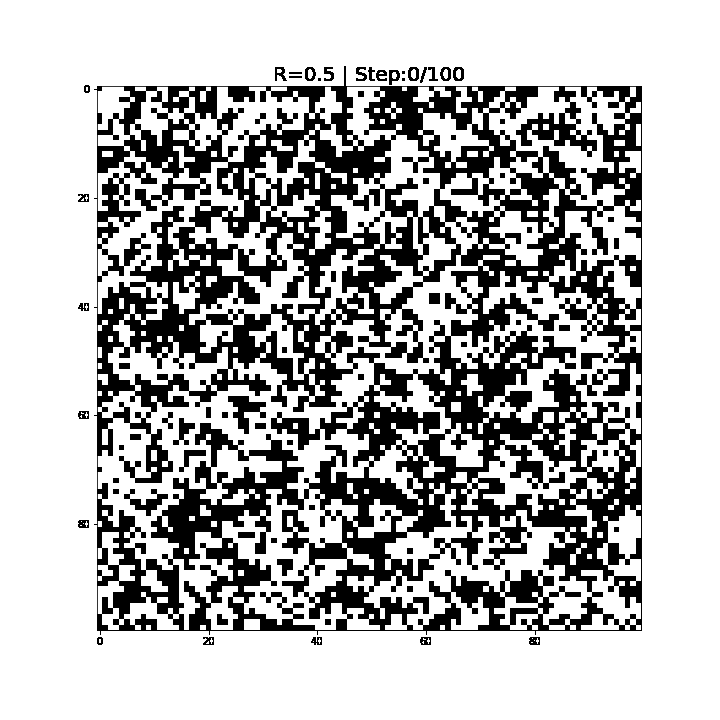

# High Performance Python Lab

## Task 1. Bifurcation diagram

[Realization](https://nbviewer.org/github/CaBuHoB/High-Performance-Python-Lab/blob/main/Tasks/Task_01.ipynb)

## Task 2. Julia set

[Realization](https://nbviewer.org/github/CaBuHoB/High-Performance-Python-Lab/blob/main/Tasks/Task_02.ipynb)

### Result

## Task 3. Schelling model

[Realization](https://nbviewer.org/github/CaBuHoB/High-Performance-Python-Lab/blob/main/Tasks/Task_03.ipynb)

### Result

